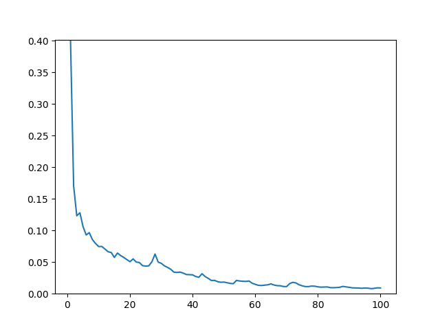
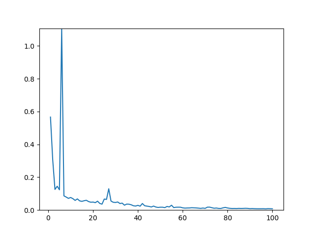

# PSPNet with ResNet34 Backbone

PSPNet is a deep learning model for semantic segmentation that uses a pyramid pooling module to capture global context information. It has been shown to outperform other methods like Fully Convolutional Networks (FCNs) on challenging scene parsing tasks.

### Model info
- Model name: PSPNet Resnet34
- Params : 8.9 million
- Size : 35.421 MB

## Hyper Parameters 

### Input Transform
- Image Width : 520 px
- Image Height : 520 px
- mean : [0.485, 0.456, 0.406]
- std : [0.229, 0.224, 0.225]

### Training
- Optimizer : Adam
- Learning rate : 0.001
- Loss function : Cross Entropy Loss
- Epochs : 100
- Batch size : 4
- Augmentation : Horizontal flip

## Results 

### Train & Validation Loss

### Outputs 

----
### Credits💫

>GitHub [@RionDsilvaCS](https://github.com/RionDsilvaCS)  ·  Linkedin [@Rion Dsilva](https://www.linkedin.com/in/rion-dsilva-043464229/)

>GitHub [@Jahnavi0504](https://github.com/Jahnavi0504)        ·  Linkedin [@CH V N S Jahnavi](https://www.linkedin.com/in/ch-v-n-s-jahnavi-51a8ab259/)

>GitHub [@Aniesh04](https://github.com/Aniesh04)        ·  Linkedin [@Aniesh Reddy Gundam](https://www.linkedin.com/in/aniesh-reddy-gundam-016365232/)

>GitHub [@CharanArikala](https://github.com/CharanArikala)        ·  Linkedin [@Sai Charan Arikala](https://www.linkedin.com/in/sai-charan-arikala-b73178219/)