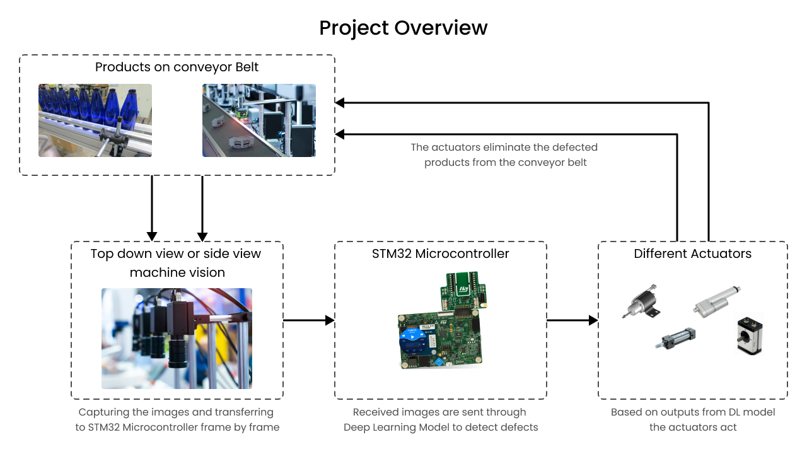
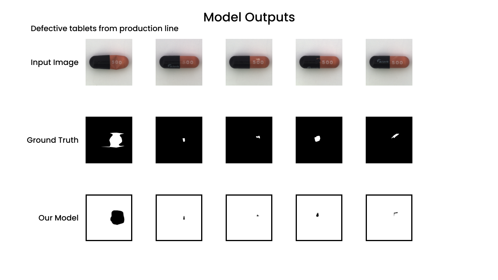
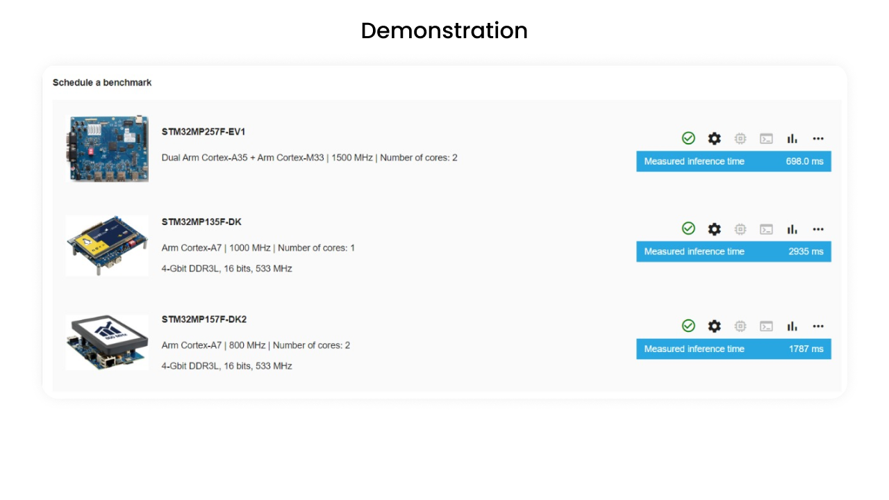

# Team RJAC Edge AI Innovation Challenge 2024

**Image Acquisition**
- OV7670 camera captures product images, transmitted via B-CAMS-OMV module to STM32H7471-DISCO

**Deep learning model segments image [Binary Segmentation]**
- Black pixels: Defect areas
- White pixels: Non-defect regions
- Enables precise defect localization and shape analysis

**Model evaluation and optimization [Defect Analysis]**
- Compare U-Net, FCN, DeepLab architectures
- Optimize for STM32 using STM32Cube.AI

**Automated Response**
- Real-time actuator control based on segmentation output for defect handling

### Deep Learning Architectures
Below are the models which choosen and compared for our use case and each model has a branch with all specifications regarding training and inference 

- U-Net
- Mask R-CNN
- DeepLab
- Fully Convolutional Networks (FCN)
- Gated-SCNN
- SegNet
- PSPNet (Pyramid Scene Parsing Network)
- HRNet (High-Resolution Network)

### Model Output

### Model inference on STM32 hardware 

### Credits💫
----

>GitHub [@RionDsilvaCS](https://github.com/RionDsilvaCS)  ·  Linkedin [@Rion Dsilva](https://www.linkedin.com/in/rion-dsilva-043464229/)

>GitHub [@Aniesh04](https://github.com/Aniesh04)        ·  Linkedin [@Aniesh Reddy Gundam](https://www.linkedin.com/in/aniesh-reddy-gundam-016365232/)

>GitHub [@CharanArikala](https://github.com/CharanArikala)        ·  Linkedin [@Sai Charan Arikala](https://www.linkedin.com/in/sai-charan-arikala-b73178219/)

>GitHub [@Jahnavi0504](https://github.com/Jahnavi0504)        ·  Linkedin [@CH V N S Jahnavi](https://www.linkedin.com/in/ch-v-n-s-jahnavi-51a8ab259/)