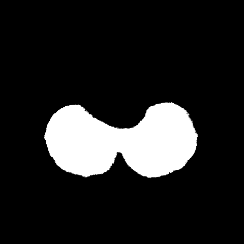

# SegNet for Semantic Segmentation

SegNet is a semantic segmentation model. This core trainable segmentation architecture consists of an encoder network, a corresponding decoder network followed by a pixel-wise classification layer. The architecture of the encoder network is topologically identical to the 13 convolutional layers in the VGG16 network. The role of the decoder network is to map the low resolution encoder feature maps to full input resolution feature maps for pixel-wise classification. The novelty of SegNet lies is in the manner in which the decoder upsamples its lower resolution input feature maps. Specifically, the decoder uses pooling indices computed in the max-pooling step of the corresponding encoder to perform non-linear upsampling.

### Model info
- Model name: SegNet
- Params :  3.1 million
- Size : 12.349 MB

## Hyper Parameters 

### Input Transform
- Image Width : 480 px
- Image Height : 480 px

### Training
- Optimizer : sgd
- Learning rate : 0.01
- Loss function : BCE With Logits Loss
- Epochs : 195
- Batch size : 4
- Augmentation : Horizontal flip

## Results 

### Train & Validation Loss

### Outputs 

----
### Credits💫

>GitHub [@RionDsilvaCS](https://github.com/RionDsilvaCS)  ·  Linkedin [@Rion Dsilva](https://www.linkedin.com/in/rion-dsilva-043464229/)

>GitHub [@Jahnavi0504](https://github.com/Jahnavi0504)        ·  Linkedin [@CH V N S Jahnavi](https://www.linkedin.com/in/ch-v-n-s-jahnavi-51a8ab259/)

>GitHub [@Aniesh04](https://github.com/Aniesh04)        ·  Linkedin [@Aniesh Reddy Gundam](https://www.linkedin.com/in/aniesh-reddy-gundam-016365232/)

>GitHub [@CharanArikala](https://github.com/CharanArikala)        ·  Linkedin [@Sai Charan Arikala](https://www.linkedin.com/in/sai-charan-arikala-b73178219/)