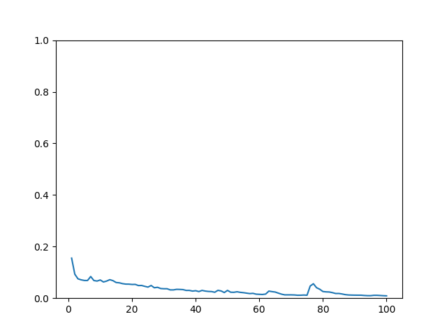
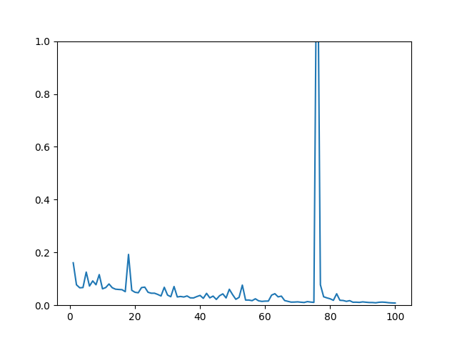
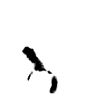
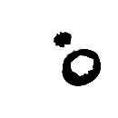
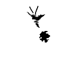

# HRNet for Semantic Segmentation

HRNet (High-Resolution Network) is a state-of-the-art deep learning model for semantic segmentation tasks. It maintains high-resolution representations throughout the entire network, unlike traditional models that first encode the input into a low-resolution representation and then recover the high-resolution output.

### Model info
- Model name: HRNet
- Params : 9.6 million
- Size : 38.54 MB

## Hyper Parameters 

### Input Transform
- Image Width : 520 px
- Image Height : 520 px
- mean : [0.485, 0.456, 0.406]
- std : [0.229, 0.224, 0.225]

### Training
- Optimizer : Adam
- Learning rate : 0.001
- Loss function : Cross Entropy Loss
- Epochs : 100
- Batch size : 4
- Augmentation : Horizontal flip

## Results 

### Train & Validation Loss

### Outputs 

----
### Credits💫

>GitHub [@RionDsilvaCS](https://github.com/RionDsilvaCS)  ·  Linkedin [@Rion Dsilva](https://www.linkedin.com/in/rion-dsilva-043464229/)

>GitHub [@Jahnavi0504](https://github.com/Jahnavi0504)        ·  Linkedin [@CH V N S Jahnavi](https://www.linkedin.com/in/ch-v-n-s-jahnavi-51a8ab259/)

>GitHub [@Aniesh04](https://github.com/Aniesh04)        ·  Linkedin [@Aniesh Reddy Gundam](https://www.linkedin.com/in/aniesh-reddy-gundam-016365232/)

>GitHub [@CharanArikala](https://github.com/CharanArikala)        ·  Linkedin [@Sai Charan Arikala](https://www.linkedin.com/in/sai-charan-arikala-b73178219/)