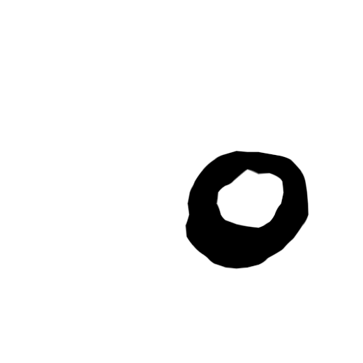

# Fully Convolutional Networks for Semantic Segmentation

Fully Convolutional Networks, or FCNs, are an architecture mostly used for semantic segmentation. They use just locally linked layers like convolution, pooling, and upsampling. Avoiding thick layers results in fewer parameters (making networks faster to train). It also means that an FCN may function with varying picture sizes if all connections are local.

### Model info
- Model name: Fully Convolutional Networks
- Params : 25.9 million
- Size : 103.509 MB

## Hyper Parameters 

### Input Transform
- Image Width : 520 px
- Image Height : 520 px
- mean : [0.485, 0.456, 0.406]
- std : [0.229, 0.224, 0.225]

### Training
- Optimizer : Adam
- Learning rate : 0.0001
- Loss function : Cross Entropy Loss
- Epochs : 100
- Batch size : 4
- Augmentation : Horizontal flip

## Results 

### Train & Validation Loss

### Outputs 

----
### Credits💫

>GitHub [@RionDsilvaCS](https://github.com/RionDsilvaCS)  ·  Linkedin [@Rion Dsilva](https://www.linkedin.com/in/rion-dsilva-043464229/)

>GitHub [@Jahnavi0504](https://github.com/Jahnavi0504)        ·  Linkedin [@CH V N S Jahnavi](https://www.linkedin.com/in/ch-v-n-s-jahnavi-51a8ab259/)

>GitHub [@Aniesh04](https://github.com/Aniesh04)        ·  Linkedin [@Aniesh Reddy Gundam](https://www.linkedin.com/in/aniesh-reddy-gundam-016365232/)

>GitHub [@CharanArikala](https://github.com/CharanArikala)        ·  Linkedin [@Sai Charan Arikala](https://www.linkedin.com/in/sai-charan-arikala-b73178219/)