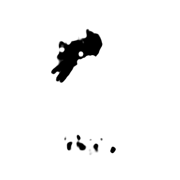

# Gated-SCNN: A Two-Stream CNN Architecture for Semantic Segmentation

Gated-SCNN is a novel two-stream CNN architecture for semantic segmentation that explicitly processes shape information in a separate stream.

### Model info
- Params : 56.4 million
- Size : 225.78 MB

## Hyper Parameters 

### Input Transform
- Image Width : 300 px
- Image Height : 300 px

### Training
- Optimizer : Adam
- Learning rate : 0.0001
- Loss function : Joint Edge loss
- Epochs : 80
- Batch size : 4
- Augmentation : Horizontal flip

## Results 

### Train & Validation Loss

### Outputs 

----
### Credits💫

>GitHub [@RionDsilvaCS](https://github.com/RionDsilvaCS)  ·  Linkedin [@Rion Dsilva](https://www.linkedin.com/in/rion-dsilva-043464229/)

>GitHub [@Jahnavi0504](https://github.com/Jahnavi0504)        ·  Linkedin [@CH V N S Jahnavi](https://www.linkedin.com/in/ch-v-n-s-jahnavi-51a8ab259/)

>GitHub [@Aniesh04](https://github.com/Aniesh04)        ·  Linkedin [@Aniesh Reddy Gundam](https://www.linkedin.com/in/aniesh-reddy-gundam-016365232/)

>GitHub [@CharanArikala](https://github.com/CharanArikala)        ·  Linkedin [@Sai Charan Arikala](https://www.linkedin.com/in/sai-charan-arikala-b73178219/)